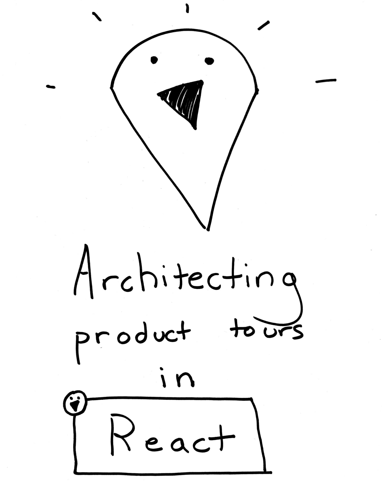

* [Getting started with monitoring for developers](https://blog.bugsnag.com/the-monitoring-landscape/)
* [SQL at Scale with Apache Spark SQL and DataFrames — Concepts, Architecture and Examples](https://towardsdatascience.com/sql-at-scale-with-apache-spark-sql-and-dataframes-concepts-architecture-and-examples-c567853a702f)
* [Understanding Production: What can you measure?](https://www.opsian.com/blog/understanding-production-what-can-you-measure/)
* [An Introduction to Join Ordering](https://www.cockroachlabs.com/blog/join-ordering-pt1/)
* [ATM Fraud Detection with Apache Kafka and KSQL](https://www.confluent.io/blog/atm-fraud-detection-apache-kafka-ksql)
* [Architecting product tours in React: How we moved fast without leaving a trail of tech debt](https://blog.asana.com/2018/10/move-fast-without-technical-debt-product-tours-react/)
