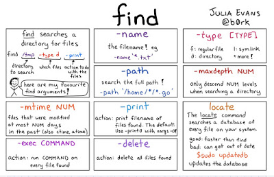

Hi guys, 100% full disk space is a common problem and as a programmer or Linux user, you often need to free disk space by deleting biggest files and directories. 
In order to do that, you need to know some Linux find command examples to list and delete some biggest files and directories and that's what you will learn in this tutorial.

In order to fix those problems you need to free up some space and when you are running out of both disk space and time, 
you need to concentrate on the biggest files and folders on your disk or partition, 
so that you can get space quickly by deleting just a couple of files and directories.

The best way is to list the top 10 directories by size and then go inside some of them, 
and find files you can delete to free space some space e.g. old log files, cache files, and heap dumps.

My preferred approach is to go into the root directory of your application and then run the find or du command to find largest directories recursively.
 From there, I can go further and delete which are occupying most of the space.

Since you may come here while searching for a quick Linux command to free some disk space, I am first listing commands you can use.

**Linux command to find biggest top 10 directories in your disk**

```
$ du -hs */ | sort -nr | head
```

This will give you the biggest directories in the disk, then you can go inside one of them, preferably the biggest ones and find files to delete using ls command.

**Linux command to Find the biggest file inside a directory**

```
$ ls -lS | head
```

That's it.  You now have the biggest files in that folder. If it is something you can delete, just delete. If you need all files just remove the head command.


**Find biggest files in any directory recursively**

We’ll now use find command, to search only files, and then sort to find out top 10 or top 5 biggest files in all directories from the current directory. 
This will print the full path of the file which you can just copy and delete to free disk space.

```
$ find -type f -ls | sort -k 7 -r -n | head -5
```

find command only list files and not directories, hence you can sort them using the column 7 (the column with the file size).

We are sorting using sort -n option for numeric order and -r reverse order (from biggest to smallest i.e. descending order), and finally only the first 5 files in the current directory and sub-directory.

If you want to find the top 5 biggest files in your machine from the root partition then you can use it like this:

```
$ find / -type f -ls | sort -k 7 -r -n | head -5
```

If you want to list the top 10 biggest files from the current directory then you can use it like this:

```
$ find . -type f -ls | sort -k 7 -r -n | head -10
```
