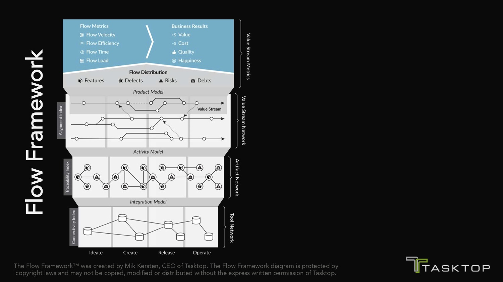

* [Project To Product: How Value Stream Networks Will Transform IT & Business](https://itrevolution.com/project-to-product-mik-kersten/)

Mik Kersten discusses about project to product transformation. He calls it The Flow Framework.
This idea of the flow framework is that you’ve have this flow distribution, and you’re measuring for flow metrics.
We need a common definition of productivity and of flow, and it’s these four units: Features, Defects, Risks and Debts.
Also Mik discover his life path and tells about his work at big IT companies.

* 

* 
