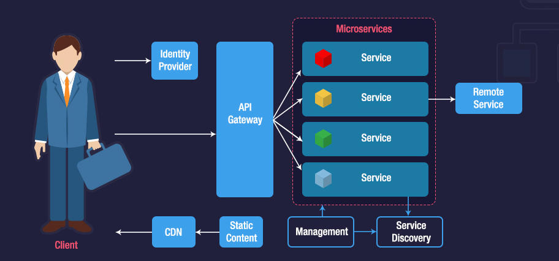

# Несколько рекомендаций при создании микросервисной архитектуры

Архитектура микросервисов в основном представляет собой множество небольших автономных сервисов, которые выполняют единую бизнес-функциональность. Изображение ниже представляет несколько микросервисов, доступ к которым осуществляется через API шлюз.

## Ссылки
- https://microservices.io/patterns/microservices.html
- https://microservices.io/patterns/apigateway.html
- https://marutitech.com/microservices-best-practices/
- https://culttt.com/2015/01/14/command-query-responsibility-segregation-cqrs/

## 1. Отдельные хранилища данных

Перед началом разработки микросервиса необходимо выделить хранилища данных для него. Это можно реализовать с помощью паттерна CQRS, чтобы организовать отдельные простанства для хранения для каждого микросервиса.

Для получения данных не в своем хранилище микросервис должен обращаться к API другого сервиса.

## 2. Создавайте отдельные команды

Микросервисы это не только возможность выстроить архитектуру вашего сервиса. Для каждого микросервиса можно выделить команду для его разработки. Сокращение скоупа для команды, позволит ей легко и быстро реализовывать новую функциональность для своего сервисами.

## 3. Автоматизируйте сборку сервисов

Важной особенностью микросервиса является возможность развертывать такой сервис независимо от других. Необходимо реализовать полный цикл сборки в автоматическом режиме - от компиляции и тестирования до развертывания на различных средах.
