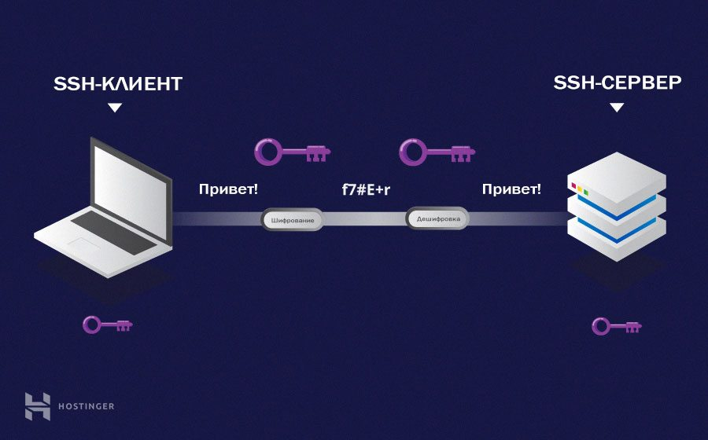

# Автоматическое завершение подвисших SSH сессий



Все очень просто, необходимо добавить в файл ```~/.ssh/config```  настройки проверки соединения и автоматического отключения.

```
ServerAliveInterval 5
ServerAliveCountMax 2
```

SSH проверяет соединение, посылая echo на удаленный хост каждые ServerAliveInterval секунды. Если больше чем на ServerAliveCountMax не было ответа, SSH отключится и завершится.

Выглядит это будет следующим образом:

```
Timeout, server 192.168.1.1 not responding.
```